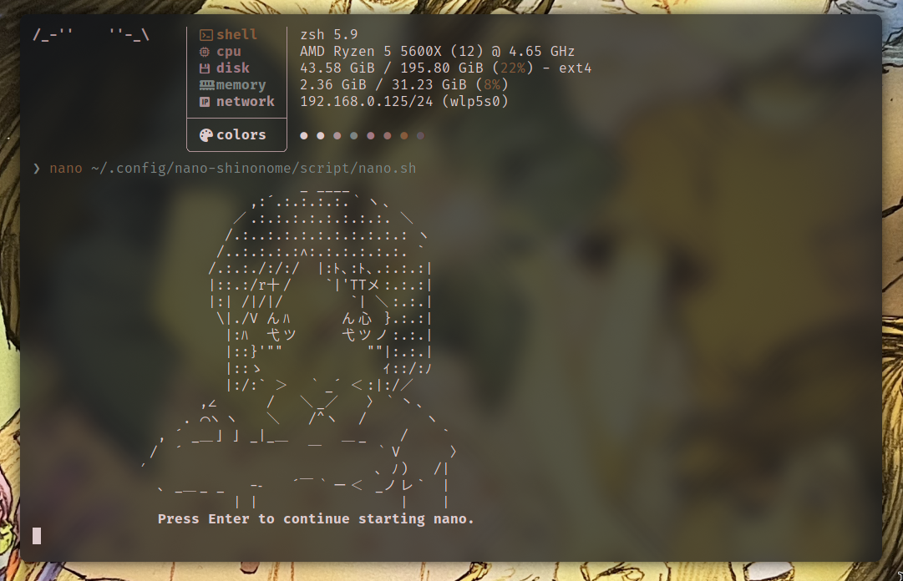

# nano-shinonome
it shows Nano-chan every time you run nano in your shell :3

Intended for use on *nix systems ofc, so mac, linux or bsd, I use it on Arch.



### Install
```bash
git clone https://github.com/m-obeid/nano-shinonome.git
cd nano-shinonome
cp -r .config ~
chmod +x ~/.config/nano-shinonome/script/nano.sh
```

Next steps are slightly different depending on your shell. I use `zsh`, so it would be:

```bash
echo 'alias "nano=~/.config/nano-shinonome/script/nano.sh"' >> ~/.zshrc
```

On `bash`, it would be:

```bash
echo 'alias "nano=~/.config/nano-shinonome/script/nano.sh"' >> ~/.bashrc
```

Finally restart your terminal. You can optionally delete the cloned repo now.

### Usage

If you dont have `nano` installed, do that first bruh.

Just run `nano` and you'll see Nano-chan! >o<

### Credits
- **Original ASCII Art** http://anime.en.utf8art.com/arc/nichijou_266.html
- **Inspired by** https://github.com/dolsup/nano-shinonome-2.5.3 

    > [!NOTE]
    > I wasn't able to compile it, and I realized that it's a really old version of `nano`, so I decided to make this much simpler alternative :3
    >
    > Also has the benefit that updating nano won't break it.

